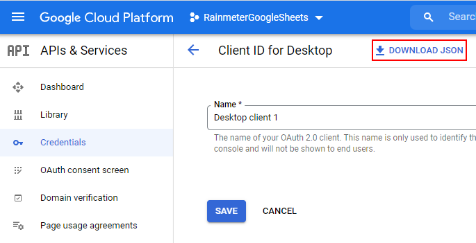

# Python Google Sheets Rainmeter Skin
Rainmeter skin will grab the value in the total row of column specified in the config. Default update rate is 10 seconds.

Uses Google Sheets API to Retrieve values.


---

## Example Google Sheet table format
| Ticker | Change Today $ |
| --------------- | --------------- |
| __AAPL__ | -100.01 |
| __MSFT__ | 201.53 |
| __Total__ | __101.52__ |

## Python Packages
```
pip install --upgrade google-api-python-client google-auth-httplib2 google-auth-oauthlib pandas argparse
```

## Rainmeter Config
```ini
[Variables]
SpreadsheetId=1BxiMVs0XRA5nFMdKvBdBZjgmUUqptlbs74OgvE2upms
Header=Change Today $
Range=A1:B4
```

## Credentials File Config (Credentials.json)
---
Google Cloud account required for Google Sheets API https://console.cloud.google.com/apis/credentials/oauthclient
### 1. Generate OAuth 2.0 Desktop App
### 2. Download Json file and replace [credentials.json](credentials.json)
